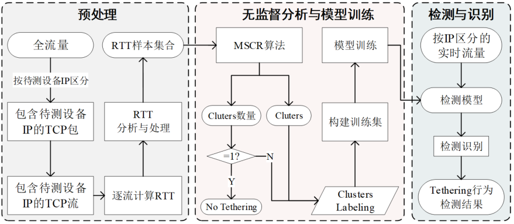

# 基于TCP流RTT的Tethering行为检测

#### 介绍
Tethering行为是一种移动设备通过自身传输介质共享其互联网连接服务的行为，这不仅对移动互联网造成运营压力和收益影响，还对移动互联网隐藏其内部网络结构，造成网络安全隐患。由于Tethering存在诸多混淆和规避方法，现有网络地址转换（Network Address Translation，NAT）检测技术难以检测Tethering行为。因此，本方法分析了移动互联网通信基站中Tethering行为终端在数据流量的处理、转发等流量特征以及移动互联网用户流量中TCP流往返时延（round trip time，RTT）的相关特性，提出了一种基于TCP流RTT的Tethering检测方法。

#### 软件架构

#### 参考文献

戴显龙,程光,陆广垠等.基于TCP流RTT的Tethering检测方法[J/OL].北京航空航天大学学报:1-13[2023-02-19].https://doi.org/10.13700/j.bh.1001-5965.2021.0463.